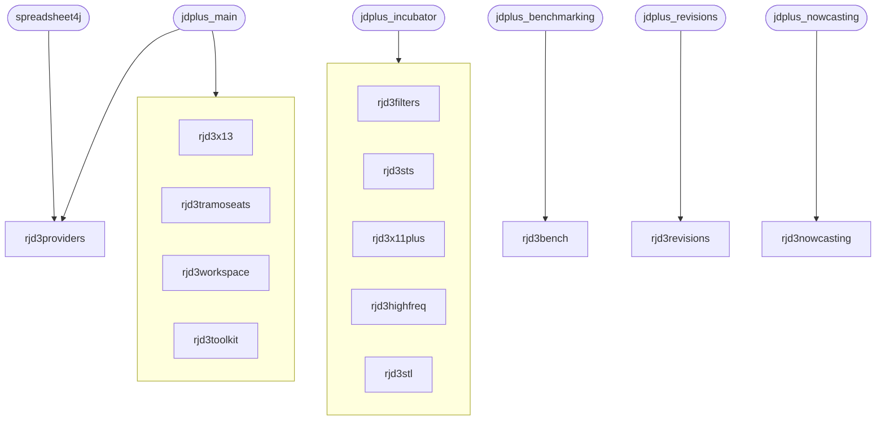

Voici le graphe des dépendances aux packages Java :

```mermaid
flowchart TB

    subgraph jdplus_main_depends[" "]

        rjd3x13

        rjd3tramoseats

        rjd3workspace

        rjd3toolkit

    end

  

    spreadsheet4j(["spreadsheet4j"]) --> rjd3providers

  

    subgraph jdplus_incubator_depends[" "]

        rjd3filters

        rjd3sts

        rjd3x11plus

        rjd3highfreq

        rjd3stl

    end

  

    jdplus_main(["jdplus_main"]) --> rjd3providers

    jdplus_main --> jdplus_main_depends

  
  

    jdplus_incubator(["jdplus_incubator"]) --> jdplus_incubator_depends

    jdplus_benchmarking(["jdplus_benchmarking"]) --> rjd3bench

    jdplus_revisions(["jdplus_revisions"]) --> rjd3revisions

    jdplus_nowcasting(["jdplus_nowcasting"]) --> rjd3nowcasting
```
