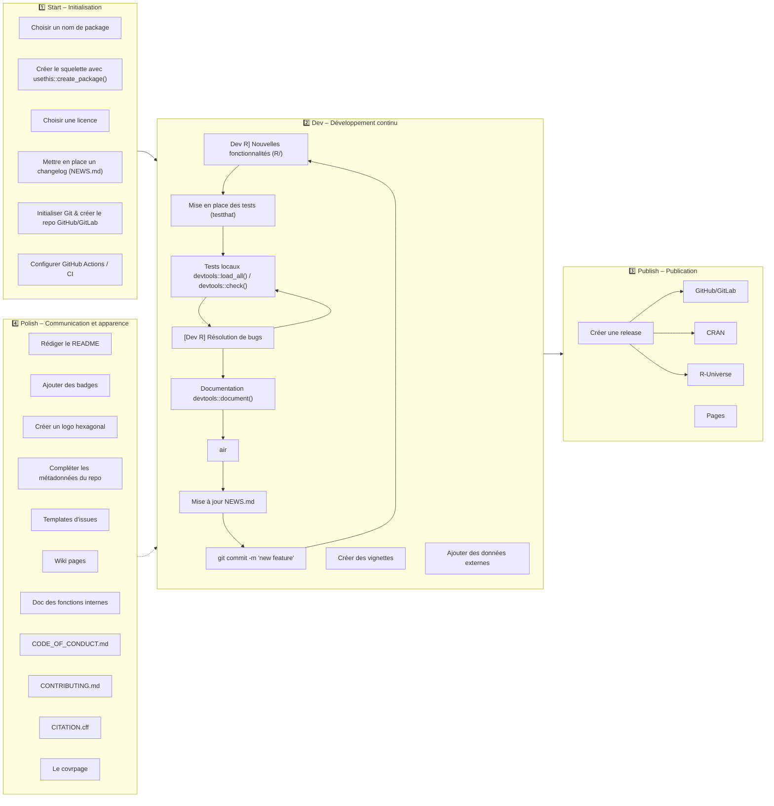

### But de ce document

Ce document s'adresse à ceux qui veulent créer un package R (ou paquet R). 
Je conseille à tous de lire le document de [Hadley Wickham and Jennifer Bryan - R-pkgs](https://r-pkgs.org/) qui explique clairement et bien plus en détail, le développement de package.
Ici j'essaye de regrouper des connaissances qui ne sont **PAS** dans les documentations classiques et de synthétiser le développement en étapes clefs. 
Ainsi je n'expliquerai pas comment faire des tests, de la documentation, créer des S3 méthodes...

Le but est de développer les bonnes pratiques pour construire un package le plus complet, accessible et maintenable possible !

La création d'un package se fait en plusieurs étapes. Le document est partagé en 3 parties :
- **01_start** : Ne faire qu'une seule fois, lors de la création du package
- **02_dev** : Travaux courant de mise à jour du package
- **03_publish** : Préparation des release, des outputs et différentes
- **04_polish** : Accessibilité et apparence (communication) de ton package
### Qu'est ce qu'un package ?
Un package R est un ensemble de fonctions R qui sont regroupé dans un même objet. Les principaux avantage de la création de packages est :
- d'éviter la redondance de définition de fonctions dans 36 projets différents
- la maintenabilité du code
- le partage et la mise à disposition des ressources
Plus de détail sur le site de [Cosima Meyer Dennis Hammerschmidt](https://socialsciencedatalab.mzes.uni-mannheim.de/article/r-package/#section1) et sur [Quand et pourquoi créer un package par Lino](https://linogaliana.gitlab.io/collaboratif/package.html#quand-cr%C3%A9er-un-package).

Concernant le 3ème point, dans ce document je présenterai Git et GitHub comme solution de versioning et d'hébergement du code.
### Références
Tout au long de ce document, je me réfèrerais aux articles qui sont en référence à la fin de mon document.
Certains documents (vraiment complets) ne nécessitent pas d'être cités de manière répétitives :
- [Hadley Wickham and Jennifer Bryan - R-pkgs](https://r-pkgs.org/)
- [r-project - Writing R Extensions](https://cran.r-project.org/doc/manuals/R-exts.html)
- [Bonnes pratiques en développement de packages R - CNRS](https://anf_bpdevr.pages.math.cnrs.fr/anf-bpdevr/)
Ces ressources ne seront citées que si elles apportent une distinction.
### Packages utilisés
Pour chaque section, je préciserai les packages utilisés. Certains packages sont utiles tout au long du processus de création et sont [quasiment indispensables](https://docs.posit.co/ide/user/ide/guide/pkg-devel/writing-packages.html#package-creation) :
- [**{devtools}**](https://github.com/r-lib/devtools)
- [**{usethis}**](https://github.com/r-lib/usethis)



## 01_start
Ici on part de zéro. Je code en R, j'aimerai créer mon premier package. 
Par où commencer et quels sont les éléments dont j'ai besoin pour faire mon package ?
Ressource :
- Une [feuille de route](https://linogaliana.gitlab.io/collaboratif/package.html#feuille-de-route-pour-cr%C3%A9er-un-package) (un peu vieille) détaillant une partie des étapes suivantes est mise à la disposition par Lino.
### Choisir un nom
Package utilisé : [**{available}**](https://github.com/r-lib/available)
Tout d'abord il faut choisir un nom. Le nom doit refléter les fonctionnalités du package. Il doit être suffisamment court et pas trop compliqué pour être tapé fréquemment sur un clavier d'ordinateur.
Aussi si on veut déployer et publier notre package, il faut s'assurer que le nom n'est pas déjà pris.
Ressources :
- Quelques indications pour aider par [Cosima Meyer Dennis Hammerschmidt](https://socialsciencedatalab.mzes.uni-mannheim.de/article/r-package/#section2)
- et par [Lino](https://linogaliana.gitlab.io/collaboratif/package.html#choisir-un-nom).
```r
available::available("monpetitpaquet", browse = FALSE)
```
### Le squelette
Pour initier un package R, il est possible d'utiliser l'interface graphique. Tout se créé de manière automatique sans avoir à créer à la main l'ensemble des fichiers, dossiers...
Ressources :
- par [Cosima Meyer Dennis Hammerschmidt](https://socialsciencedatalab.mzes.uni-mannheim.de/article/r-package/#section3) 
- par [ThinkR (Etape 1)](https://thinkr.fr/creer-package-r-quelques-minutes/)
- sur le [RStudio guide](https://docs.posit.co/ide/user/ide/guide/pkg-devel/writing-packages.html#package-creation)
Il est aussi possible de créer un package avec une [ligne de code](https://docs.posit.co/ide/user/ide/guide/pkg-devel/writing-packages.html#package-creation) (aussi [ici](https://linogaliana.gitlab.io/collaboratif/package.html#cr%C3%A9er-un-projet-RStudio-de-type-package)).
```r
usethis::create_package()
```
#### DESCRIPTION
Le fichier **DESCRIPTION** contient les metadata du package. 
Pour un package R, le fichier doit commencer par :

```
Package: Nom du package
Type: Package
```

Cela permettre de mieux gérer votre projet ainsi que ses dépendances.
Le fichier **DESCRIPTION** contient aussi les numéros de version du package (Voir la [nomenclature](https://semver.org/lang/fr/)).
Dans le champ `URL` , il est possible de mettre plusieurs liens. Par exemple, le lien du repo GitHub, le liens des GitHub pages, le lien du site web si il existe ou autre...
Ressources :
- Lino détaille le [contenu](https://linogaliana.gitlab.io/collaboratif/package.html#renseigner-les-m%C3%A9ta-donn%C3%A9es-du-package-le-fichier-description) du fichier **DESCRIPTION**
- [Gérer les numéros de version avec Lino](https://linogaliana.gitlab.io/collaboratif/package.html#g%C3%A9rer-les-num%C3%A9ros-de-version)
- Plus d'information par ([ThinkR (Etape 2)](https://thinkr.fr/creer-package-r-quelques-minutes/))
#### Dossier R/
Le coeur du package est évidemment le code R et les fonctions qui ajoutent le dynamisme au package. C'est ici que l'utilisateur entrepose ses codes R qui contiendront aussi la documentation de ses fonctions.
Un package R est un ensemble de fonctions donc il ne doit pas y avoir de programmes ou de bout de code en dehors de ce cadre.
Ressources :
- [Inclure du code](https://linogaliana.gitlab.io/collaboratif/package.html#inclure-du-code-le-documenter-et-le-tester) par Lino
#### Documentation dossier man/
La documentation est générée automatiquement avec `devtools::document()` (ou on clique dans RStudio).
### Paramétrage de RStudio
Enfin il peut être utile de paramétrer l'interface de code RStudio pour appliquer les mêmes conventions d'édition. Par exemple, pour tous mes projets R, j'applique cette règle :
```
Version: 1.0

RestoreWorkspace: No
SaveWorkspace: No
AlwaysSaveHistory: No

EnableCodeIndexing: Yes
UseSpacesForTab: Yes
NumSpacesForTab: 4
Encoding: UTF-8

RnwWeave: Sweave
LaTeX: pdfLaTeX

AutoAppendNewline: Yes
StripTrailingWhitespace: Yes

UseNativePipeOperator: Yes

SpellingDictionary: en_GB
```
### Git
Qui dit projet R et bonne pratique dit versioning !
Utiliser Git dans un package R est très classique et quasiment indispensable.
Ressources :
- [Lino](https://linogaliana.gitlab.io/collaboratif/package.html#utiliser-git-dans-le-projet-RStudio) décrit comment utiliser Git avec un projet RStudio.
### GitHub
GitHub est une solution de sauvegarde d'un projet en ligne. GitHub offre des possibilités d'hébergement de projet publics comme privés.
La communauté autour de GitHub est assez importante. 
Enfin les possibilités d'*actions* (GitHub Action) pour faire du CI/CD automatiquement sont très utiles dans le développement de packages.
### LICENCE / LICENSE
Il est important d'ajouter une licence à un projet open source (ou pas) pour préciser aux utilisateur du package dans quelle mesure le package peut être utilisé, copié ou distribué.
Ressources :
- [Comment choisir une licence](https://anf_bpdevr.pages.math.cnrs.fr/anf-bpdevr/17-licence.html#choisir-une-licence)
- [Software LICENCES](https://kbroman.org/pkg_primer/pages/licenses.html)
- [choosealicence](https://choosealicense.com/)
{usethis} propose d'ajouter des licences par défaut :
```r
# Choisir une licence 
usethis::use_mit_license(
  name = "Institut national de la statistique et des études économiques (Insee)"
)
```
Concernant les licences, il est possible d'ajouter un fichier LICENCE ou LICENSE pour préciser une licence particulière dans le fichier DESCRIPTION : 
```
License: file LICENCE
```
Ou
```
License: EUPL + file LICENCE
```
Ces fichiers (LICENCE ou LICENSE) sont reconnus sur GitHub et affiché de manière particulière dans le répertoire
### CHANGELOG
Le **CHANGELOG** ou **NEWS.md** contient les informations de mise à jour du package. A chaque fois 
- qu'un bug est résolu, 
- qu'une fonction ou un argument est renommé ou modifié
- qu'une fonctionnalité majeure est dévelopée
il faut le spécifier dans le **CHANGELOG**.
Il existe plusieurs formats de changelog. Je recommande [cette convention](https://keepachangelog.com/fr).
Ressources :
- Formation de Lino : [Créer un CHANGELOG](https://linogaliana.gitlab.io/collaboratif/package.html#cr%C3%A9er-un-changelog)
### GitHub Action et GitLab CI
Voici une liste des différents workflow qui peuvent être intéressant de mettre en place:
- lint (packages [**{styler}**](https://github.com/r-lib/styler), [**{lintr}**](https://github.com/r-lib/lintr/) et [**{flint}**](https://github.com/etiennebacher/flint), `.lintr` file)
- check (package [**{devtools}**](https://github.com/r-lib/devtools))
- test coverage (package [**{covr}**](https://github.com/r-lib/covr))
- check NEWS.md / CHANGELOG.md (voir [check-changelog](https://github.com/InseeFrLab/rjdworkspace/blob/master/.github/workflows/check-changelog.yml))
- automated code review (codefactor...)
Ressources : 
- [Lino](https://linogaliana.gitlab.io/collaboratif/package.html#utiliser-lint%C3%A9gration-continue-de-gitlab) décrit comment utiliser le CI de GitLab.
- Plus d'information sur [Travis CI](https://juliasilge.com/blog/beginners-guide-to-travis/)
### .gitignore
Le fichier `.gitignore` permet de filtrer les fichiers et objets que l'on ne veut pas garder dans notre répertoire. Par exemples, les fichiers temporaires, les outputs pdf ou html, les caches, token et secrets...
Voilà un exemple de `.gitignore` détaillé :

```gitignore
# History files
.Rhistory
.Rapp.history

# Session Data files
.RData
.RDataTmp

# User-specific files
.Ruserdata

# Example code in package build process
*-Ex.R

# Output files from R CMD build
/*.tar.gz

# Output files from R CMD check
/*.Rcheck/

# RStudio files
.Rproj.user/

# produced vignettes
vignettes/*.html
vignettes/*.pdf
Meta/
inst/doc/
doc/

# OAuth2 token, see https://github.com/hadley/httr/releases/tag/v0.3
.httr-oauth

# knitr and R markdown default cache directories
*_cache/
/cache/

# Temporary files created by R markdown
*.utf8.md
*.knit.md

# R Environment Variables
.Renviron

# pkgdown site
docs/

# translation temp files
po/*~

# RStudio Connect folder
rsconnect/

# Hidden file from mac-os
.DS_Store

# produced README.html
README.html

pom.xml.versionsBackup
```
### .Rbuildignore
Le fichier `.Rbuildignore` liste les fichiers de mon répertoire qui ne doivent pas être inclus dans le package source (construit avec `R CMD build monpackage`). Une petite liste est dressée [ici](https://www.r-bloggers.com/2020/05/non-standard-files-directories-rbuildignore-and-inst/).
Voilà un exemple de fichier `.Rbuildignore` :

```Rbuildignore
^.*\.Rproj$
^\.Rproj\.user$

^\.git$
^\.github$

^README\.Rmd$
^README-.*\.png$
^README\.html$

^Meta$
^docs$
^doc$
^pkgdown$
^_pkgdown\.yml$

^\.lintr$

^appveyor\.yml$
.travis.yml

cran-comments.md

^\.DS_Store$

^revdep$
^reconf\.sh$

^pom\.xml$

^CITATION\.cff$
^LICENSE.md$
^LICENSE$

^\.httr-oauth$
^\.zenodo\.json$

^checklist.yml$
^codecov\.yml$
^data-raw$
^dev$

^man-roxygen$
^organisation.yml$
^cran-comments\.md$
```

## 02_dev
Lorsqu'on travaille au quotidien sur son package, le workflow a adopter est le suivant :
- (1) Développements en R (nouvelle fonctionnalité `usethis::use_r("new_fun")`, résolution de bug...) ^dev
- (2) `devtools::load_all()` et teste que tout marche
- (3) Ajout de nouveaux tests `usethis::use_test("new_fun")`
- (4) Documentation (`devtools::document()`), si erreur, retour au point (1) [[Comment faire un paquet R#^dev|Developpement]]
- (5) Check (`devtools::check()`), si erreur, retour au point (1) [[Comment faire un paquet R#^dev|Developpement]]
- (6) Mise à jour du fichier `NEWS.md`
- (7) `git commit -m "new functionnality"`
### Remplir le package
Pour alimenter un package, il faut lui donner plusieurs éléments:
- des fonctions R (dans le dossier **R/**) ([ThinkR (Etape 3)](https://thinkr.fr/creer-package-r-quelques-minutes/))
```r
usethid::use_r("my_r_file")
```
- la documentation des fonctions R (dans le dossier **man/**) ([ThinkR (Etape 4)](https://thinkr.fr/creer-package-r-quelques-minutes/))
```r
devtools::document()
```
- un **NAMESPACE**

Cette structure a été construit automatiquement à l'étape précédente. De manière générale, l'utilisateur ne doit pas toucher au **NAMESPACE** ainsi qu'au dossier **man**.
Les seuls fichiers à modifier par l'utilisateur sont les fichiers `.R` et le fichier **DESCRIPTION**.
Plus d'info sur les fichiers à modifier dans un package par [Cosima Meyer Dennis Hammerschmidt](https://socialsciencedatalab.mzes.uni-mannheim.de/article/r-package/#section4).

### DESCRIPTION
Le fichier **DESCRIPTION** doit être mis à jour régulièrement (notamment avec les nouvelles dépendances ainsi que les numéros de versions qui augmentent). Il est utile de lancer la commande: 
```r
attachment::att_amend_desc()
```
Pour mettre à jour et formatter le fichier **DESCRIPTION**.
### R CMD Check
Packages utilisés :
- [**{rhub}**](https://github.com/r-hub/rhub)
- [**{inteRgrate}**](https://github.com/jumpingrivers/inteRgrate)
Une fois le package remplis de fonctions R bien documentées, il est temps de vérifier que le package fonctionne bien. Pour cela on appelle `devtools::check()` (ou on clique dans RStudio).
Ressources :
- Plus d'information par [Cosima Meyer Dennis Hammerschmidt](https://socialsciencedatalab.mzes.uni-mannheim.de/article/r-package/#section5) 
- et par [Lino](https://linogaliana.gitlab.io/collaboratif/package.html#inclure-des-tests).
### Tests
Packages utilisés :
- [**{testthat}**](https://github.com/r-lib/testthat/)
Le but des tests est d'ajouter des tests unitaires au packages. On cherche à s'assurer que, quelques soient les modifications dans le code, il fonctionne correctement :
- Toutes les fonctions renvoient le bon et surtout le même résultat identiquement
- Toutes les fonctions échouent (ou renvoient une erreur/un warning) lorsqu'il y a un problème
- Toutes les fonctions n'échouent pas le reste du temps.
Ressources :
- Utiliser **{testthat}** par [Lino](https://linogaliana.gitlab.io/collaboratif/package.html#utiliser-testthat-pour-les-tests).
```r
usethis::use_testthat()
usethis::use_test("my_function")
```
### Couverture
Package utilisé :
- [**{covr}**](https://github.com/r-lib/covr)
Le taux de couverture est le pourcentage de lignes de code couvertes par des tests. Il faut évidemment viser 100%.
### Ajouter des checks
Package utilisé :
- [**{assertthat}**](https://github.com/hadley/assertthat) (deprecated ?)
- [**{checkmate}**](https://github.com/mllg/checkmate/)
Il est important d'ajouter des checks dans les fonctions pour vérifier les inputs de l'utilisateur. Pour cela, on peut utiliser le package **{checkmate}** ou **{assertthat}** pour vérifier des assertions (variable bien numérique, classe de l'input).
Ressources :
- [comment gérer les erreurs](https://anf_bpdevr.pages.math.cnrs.fr/anf-bpdevr/15-erreurs.html)
### Données externes
Il est intéressant d'ajouter des données externes à son package pour permettre à l'utilisateur d'accéder à certains jeux de données.
Ressources :
- [Pourquoi inclure des données ?](https://anf_bpdevr.pages.math.cnrs.fr/anf-bpdevr/10-donnees.html#pourquoi-inclure-des-donn%C3%A9es)
### Vignettes
Les vignettes jouent un rôle centrale dans la communication de notre package et surtout l'illustration des fonctions. Une vignette est un document de démonstration du package. Elle contient du texte, du code  et aborde souvent une partie des fonctionnalités du package (il faut plusieurs vignettes pour couvrir l'ensemble d'un package).
Les avantages d'une vignette sont :
- d'être ciblé sur un sujet (contrairement au README qui est généraliste)
- d'être aussi long qu'on veut (le README doit être un minimum succinct)
- de contenir du textes, code, illustrations, graphiques, tables
- d'être accessible sur RStudio et sur le CRAN dans l'aide du package
- d'être accessible au formats HTML et PDF
Ressources :
- [Création de Vignettes par Lino](https://linogaliana.gitlab.io/collaboratif/package.html#cr%C3%A9er-une-vignette-recommand%C3%A9).
```r
usethis::use_vignette("fun1_my_package")
```
### air
air est un outils utile pour formatter du code R. Il peut être installé facilement sur toutes les plateformes https://github.com/posit-dev/air?tab=readme-ov-file#installation.
Pour l'utiliser, il suffit d'appeler :
```
air format .
```
### Checks additionnels
Package utilisé :
- [**{goodpractice}**](https://github.com/ropensci-review-tools/goodpractice)
Le package **{devtools}** offre un check basic qui est très important mais pour aller plus loin, on peut profiter de checks additionnels non testés avec `devtools::check()` (comme `devtools::spell_check()`) ou du package **{goodpractice}**.
## 03_publish
### Faire des releases
Les releases sont les publications de versions de notre package. A chaque fois que le package est mis à jour (avec de nouvelles fonctionnalités), il est important de faire une release pour créer une nouvelle version du package.
L'intérêt de créer des release est de versionner le package en versions stable pour les utilisateurs dans des chaînes de production par exemple.
### Le CRAN
Le graal pour un développeur de package est d'avoir son package sur le CRAN.
Le CRAN est le [Comprehensive R Archive Network](https://cran.r-project.org/). C'est une archive de packages R permettant de les répertorier, versionner (selon la version de R) et de les rendre accessibles.
Si votre package est déjà sur GitHub ou GitLab, il est accessible sur internet. Mais être sur le CRAN est une marque de qualité, de sureté et de sécurité pour un package (Voir les [CRAN Repository Policy](https://cran.r-project.org/web/packages/policies.html)).

Pour ajouter un package sur le CRAN, il faut s'assurer que le package passe bien le check, mais aussi des checks additionnels.
Il est possible (et obligatoire) de tester son package sur les serveurs du CRAN avec les mêmes paramètres que le CRAN :
- [Pour tester sur Windows](https://win-builder.r-project.org/upload.aspx)
- [Pour tester sur MacOS](https://mac.r-project.org/macbuilder/submit.html)
Une fois le package testé de fond en comble (en local, sur GitHub et sur le CRAN), il peut être chargé sur le CRAN mais sera relu et examiné par les mainteneurs du CRAN avant d'être publié : https://cran.r-project.org/submit.html.

Ressources :
- Saskia O. a rédigé une [checklist des vérifications](https://www.marinedatascience.co/blog/2020/01/09/checklist-for-r-package-re-submissions-on-cran/) à faire avant une soumission sur le CRAN. Une bonne partie est déjà décrite dans ce document.
- voir [Cosima Meyer Dennis Hammerschmidt](https://socialsciencedatalab.mzes.uni-mannheim.de/article/r-package/#section6)
## 04_polish
Il est possible d'ajouter de nombreux éléments au package pour le rendre plus accessible aux utilisateurs qui voudraient se renseigner pour l'utiliser. 
Plus d'information sur le site de [Cosima Meyer Dennis Hammerschmidt](https://socialsciencedatalab.mzes.uni-mannheim.de/article/r-package/#section7).
### README
Le README est la première vitrine du package (voir aussi le site web). 
Pour la construction du README.md, les choses à penser :
- Création d'un README qui décrit le package,
- Ajouter des badges avec l'avancement du projets et les différentes GHA
- Ajouter les codes d'installation du packages (via CRAN, GitHub, R-Universe et autres sources si besoin)
- Donner des exemples de code,
- Mettre des images, des GIFS, ...
- Ajouter une traduction FR ou EN ou d'autres langues pour les utilisateurs
- Donner une liste de contacts à la fin et les différents liens relatifs au projet
- Ajouter les réseaux (GitHub, YouTube, mail...)
Ressources :
- Lino explique comment [initier un README](https://linogaliana.gitlab.io/collaboratif/package.html#cr%C3%A9er-un-fichier-readme-obligatoire).
### {covrpage}
J'ai découvert ce package récemment et malheureusement, il date un peu.
Le but est de fournir un rapport détaillé de la couverture par les tests du package.
Il faut lancer :
```r
covrpage::covrpage()
```
Cela ajoute une page README au dossier tests/.
Ensuite, il peut être utile d'ajouter une GHA qui s'occupe d'appeler cette fonction pour mettre à jour le README.
### Badges
Les badges représentent des meta-informations sur le package comme :
- l'état du check
- le package sur le CRAN
- ...
Ils apparaissent dans le README.
### Logo
Package utilisé :
- [**{hexSticker}**](https://github.com/GuangchuangYu/hexSticker)
Pour un peu plus d'esthétisme, on peut avoir envie de créer un logo (/ hexagone) et une bannière GitHub.
### GitHub Pages
Package utilisé :
- [**{pkgdown}**](https://pkgdown.r-lib.org)
Une fois le package hébergé sur GitHub, GitLab ou autre, toutes les ressources sont disponibles en ligne et le README est la première vitrine du répertoire. Seulement il est intéressant aussi de [créer une page web](https://anf_bpdevr.pages.math.cnrs.fr/anf-bpdevr/19-doc-site-web.html#page-web)pour le répertoire avec toutes les ressources de manières plus accessible (le README est une seule page alors qu'avec les pages on peut gérér un site web entier).
### Metadata (about section, links et topics)
Sur GitHub il est possible de remplir des informations complémentaires dans la section `About` :
- Description : court texte pour résumer le contenu du repertoire
- Website : URL menant au site web du package
- Topics : liste de sujets qui s'appliquent au projet (souvent `r`, `rstats`, `r-package`, `package`...)
### Issues personnalisées
Il est possible de créer des issues personnalisées pour un repo GitHub.
C'est utile pour guider les utilisateurs de votre package dans leur demande et trier ensuite les issues selon les thèmes.
### Wiki pages
Sur GitHub, il est possible de créer des wiki pages. Ce sont des formes de documentation propre à GitHub et qui ne sont pas hébergé dans le repo.
### Documentation function non exported
La documentation des fonctions non exportées n'est pas obligatoire pour le CRAN et n'est même pas recommandée.
Leur explication:
> Normally, functions which are important enough to be documented via an example are important enough to be exported.

Je ne suis pas d'accord, car la documentation est extrêmement utile pour les utilisateurs mais aussi pour les développeurs !
Je recommande de documenter un minimum ces fonctions lorsque tout le reste est fait.
### Traduction
Proposer des traductions de la documentation (package **{potools}**, po folder et .pot files).
On peut se référer aux liens suivants :
- <https://cran.r-project.org/doc/manuals/r-devel/R-exts.html#R-messages>
- <https://cran.RStudio.com/doc/manuals/r-devel/R-exts.html#Internationalization>
- <https://r-pkgs.org/misc.html#other-directories>
- <https://michaelchirico.github.io/potools/>
Pour l'instant, je ne suis pas au clair avec les solutions d'internationalisation des packages.
### Contributor Code of Conduct (CODE_OF_CONDUCT.md file)
Ce fichier définit les **règles de comportement attendues** de la part des contributeurs au projet. Il vise à créer un environnement **accueillant, respectueux et inclusif** pour tout le monde.
### Guide de contribution -  CONTRIBUTING.md file
Ce fichier explique **comment contribuer correctement au projet**. Il sert de guide pratique pour les développeurs souhaitant participer.

Il peut inclure :
- Comment cloner le dépôt, créer une branche, faire une PR (pull request).
- Les règles de formatage du code, conventions de commit (par ex. Conventional Commits).
- Les outils à utiliser (tests, linter, etc.).
- Où poser des questions ou demander de l’aide.
- Comment signaler des bugs ou proposer des améliorations.
### CITATION.cff
Le fichier `CITATION.cff` est un fichier permettant aux utilisateurs de citer ton travail. Plus d'information sur le package [**{cffr}**](https://github.com/ropensci/cffr) qui permet de créer des citations pour les packages R.
Le fichier est à placer à la racine du répertoire ainsi que dans le dossier `inst/`.
## Les autres vecteurs de communication
#### GitLab
Comme GitHub, GitLab propose des solutions d'hébergement. 
#### R-Universe
R universe est une solution CRAN-like qui permet l'hébergement mais aussi la construction de packages R. 
## Notions additionnelles
### Rtools
Comme on en a parlé dans la sequence sur comment [[Installer un package R]], **Rtools** est un outils pour compiler les packages R.
**Rtools** vient avec une version de R. Ainsi pour chaque version X.Y de R, il faut une nouvelle version de **Rtools**. 
Pour installer **Rtools**, il faut se rendre sur [cet URL](https://cran.r-project.org/bin/windows/Rtools/).
### Dépendances
Ressources :
- Apprenez à [gérer les dépendances avec Lino](https://linogaliana.gitlab.io/collaboratif/package.html#d%C3%A9clarer-une-d%C3%A9pendance).
### Projets RStudio
Les packages sont des projets RStudio. De manière générale, c'est une bonne pratique de créer une structure de Rproj pour chacun de ses projets R.
La principale différence entre un projet et un package est (de mon point de vue), le côté expérimentale ou temporaire du projet. On cherche ici à faire une étude que l'on ne répètera pas et on veut juste archiver correctement le code. Si le code est réutilisé une seconde fois, il est **justifié** et **nécessaire** de faire un package R.
Aussi, les projets RStudio peuvent arborer une structure très proche des packages R (R, man, DESCRIPTION et NAMESPACE).
## Ressources

- 🇬🇧 [Hadley Wickham and Jennifer Bryan - R-pkgs](https://r-pkgs.org/)
- 🇬🇧 [r-project - Writing R Extensions](https://cran.r-project.org/doc/manuals/R-exts.html)
- 🇫🇷 [Lino Galiana - Travail collaboratif avec R](https://linogaliana.gitlab.io/collaboratif/package.html), ce document n'est plus maintenu et remplacé par la [formation aux bonnes pratiques](https://inseefrlab.github.io/formation-bonnes-pratiques-git-R/slides/complete.html)
- 🇫🇷 [Thinkr - Créer un package R en quelques minutes](https://thinkr.fr/creer-package-r-quelques-minutes/)
- 🇬🇧 [posit - Writing Packages](https://docs.posit.co/ide/user/ide/guide/pkg-devel/writing-packages.html)
- 🇫🇷 [Bonnes pratiques en développement de packages R - CNRS](https://anf_bpdevr.pages.math.cnrs.fr/anf-bpdevr/)
- 🇬🇧 [R package primer - Karl Broman](https://kbroman.org/pkg_primer/), a bit outdated
- 🇬🇧 [checklist for CRAN submission - Saskia O.](https://www.marinedatascience.co/blog/2020/01/09/checklist-for-r-package-re-submissions-on-cran/)
- 🇬🇧 [Writing good R packages - Maëlle Salmon](https://masalmon.eu/2017/12/11/goodrpackages), a bit outdated
- 🇬🇧 [A list](https://indrajeetpatil.github.io/awesome-r-pkgtools/) of additional tools to build and develop R package

