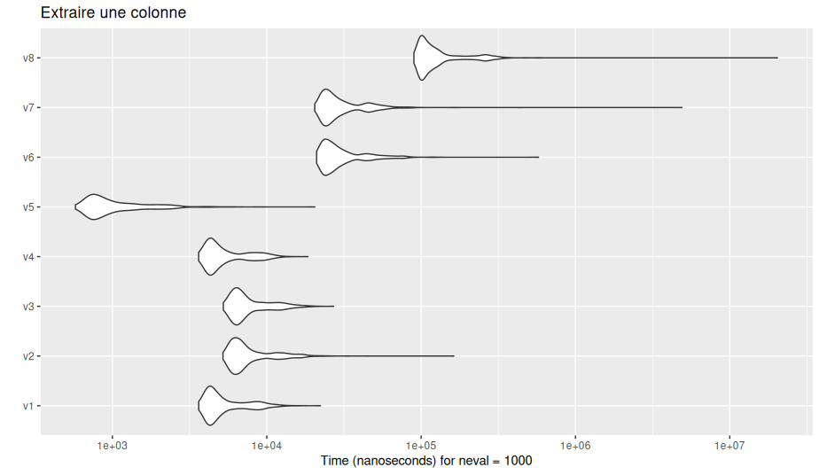
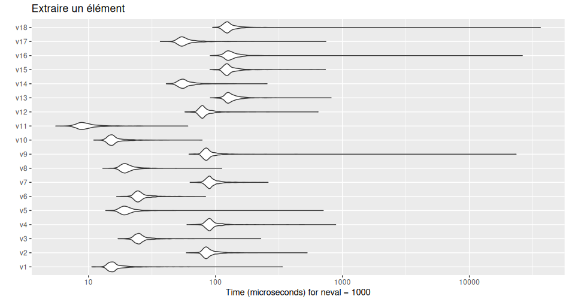
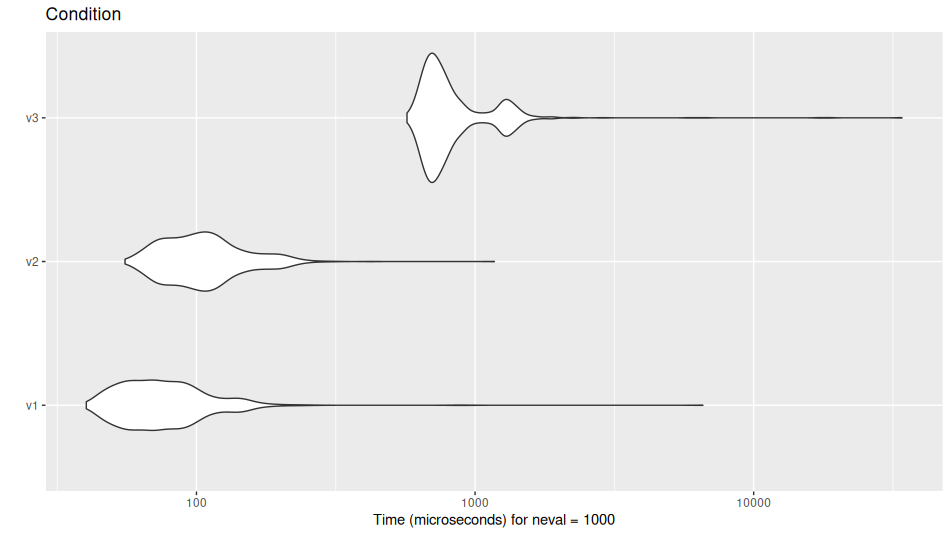
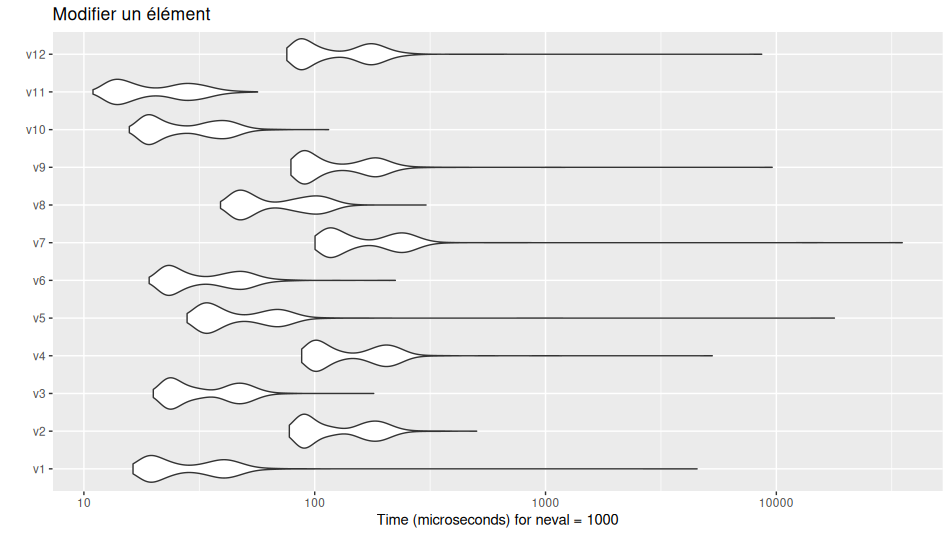
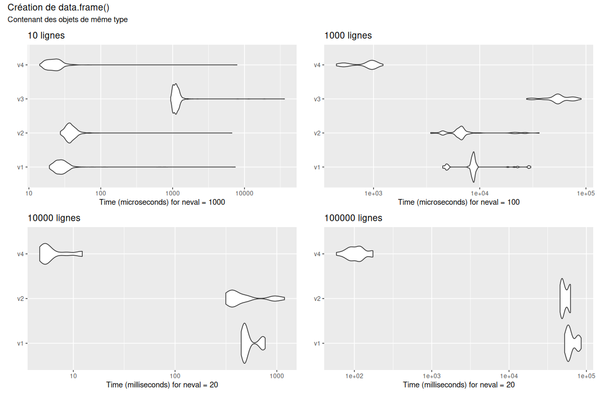
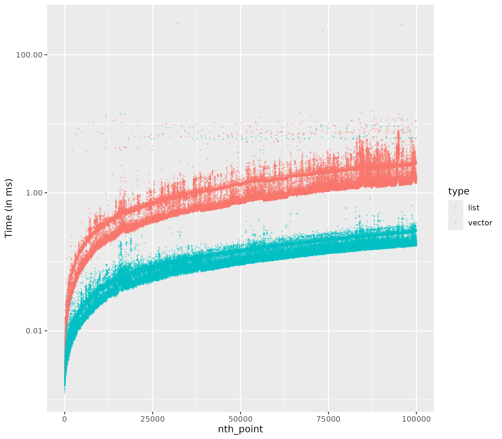
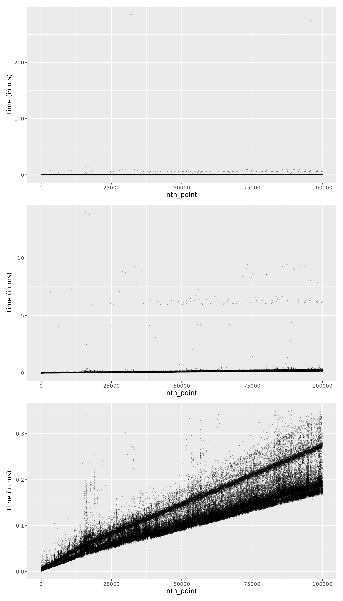
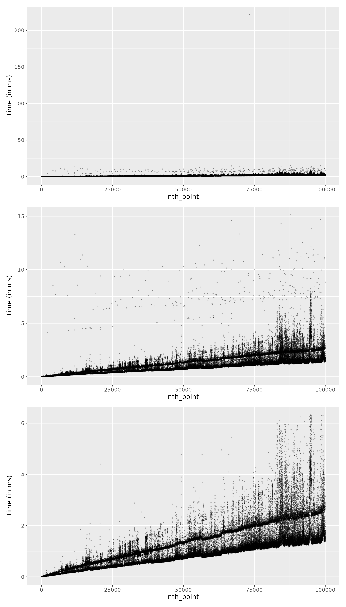

Dans cette fiche, on compare la vitesse de différentes méthodes en R.

### Packages

```r
library("ggplot2")
library("microbenchmark")
```
### Extraction de colonnes

> [!info]- Détail du code
> 
> ```r
> extraction_colonne <- microbenchmark(
>     v1 = iris[["Species"]], 
>     v2 = iris[, "Species"], 
>     v3 = iris[, 5], 
>     v4 = iris[[5]], 
>     v5 = iris$Species, 
>     v6 = subset(iris, select = "Species", drop = TRUE), 
>     v7 = subset(iris, select = 5, drop = TRUE), 
>     v8 = dplyr::pull(iris, Species), 
>     times = 1000
> )
> 
> autoplot(extraction_colonne) + 
>     ggtitle("Extraire une colonne")
> ```




### Extraction d'élément

> [!info]- Détail du code
> 
> ```r
> extraction_elt <- microbenchmark(
>     v1 = iris[["Species"]][4], 
>     v2 = iris[4, ][["Species"]], 
>     v3 = iris[4, "Species"], 
>     v4 = iris[4, ][, "Species"], 
>     v5 = iris[, "Species"][4], 
>     v6 = iris[4, 5], 
>     v7 = iris[4, ][, 5], 
>     v8 = iris[, 5][4], 
>     v9 = iris[4, ][[5]], 
>     v10 = iris[[5]][4], 
>     v11 = iris$Species[4], 
>     v12 = iris[4, ]$Species, 
>     v13 = subset(iris, select = "Species")[4, ], 
>     v14 = subset(iris, select = "Species", drop = TRUE)[4], 
>     v15 = subset(iris[4, ], select = "Species", drop = TRUE),
>     v16 = subset(iris, select = 5)[4, ], 
>     v17 = subset(iris, select = 5, drop = TRUE)[4], 
>     v18 = subset(iris[4, ], select = 5, drop = TRUE),
>     times = 1000
> )
> autoplot(extraction_elt) + 
>     ggtitle("Extraire un élément")
>     ```




### Condition

Puis faire la même chose avec une comparaison de subset, filter et x[condition, ] :

> [!info]- Détail du code
> 
> ```r
> condition <- iris$Sepal.Length > 6
> 
> filtrage <-  microbenchmark(
>     v1 = iris[condition, ], 
>     v2 = subset(iris, condition), 
>     v3 = dplyr::filter(iris, condition), 
>     times = 1000
> )
> 
> autoplot(filtrage) + 
>   ggtitle("Condition")
> ```




### Modifier une case

> [!info]- Détail du code
> 
> ```r
> modification_elt <- microbenchmark(
>     v1 = {iris[["Species"]][4] <- "versicolor"}, 
>     v2 = {iris[4, ][["Species"]] <- "versicolor"}, 
>     v3 = {iris[4, "Species"] <- "versicolor"}, 
>     v4 = {iris[4, ][, "Species"] <- "versicolor"}, 
>     v5 = {iris[, "Species"][4] <- "versicolor"}, 
>     v6 = {iris[4, 5] <- "versicolor"}, 
>     v7 = {iris[4, ][, 5] <- "versicolor"}, 
>     v8 = {iris[, 5][4] <- "versicolor"}, 
>     v9 = {iris[4, ][[5]] <- "versicolor"}, 
>     v10 = {iris[[5]][4] <- "versicolor"}, 
>     v11 = {iris$Species[4] <- "versicolor"}, 
>     v12 = {iris[4, ]$Species <- "versicolor"}, 
>     times = 1000
> )
> 
> autoplot(modification_elt) + 
>     ggtitle("Modifier un élément")
> ```




### Création

> [!info]- Détail du code
> 
> ```r
> library("patchwork")
> 
> # Même type (dans un vecteur)
> 
> precreate_with_list <- function(n, p = 3) {
>     l <- vector("list", n)
>     for (k in seq_len(n)) {
>         l[[k]] <- rep(1, p)
>     }
>     df <- do.call(l, what = rbind)
>     return(df)
> }
> 
> precreate_with_df <- function(n, p = 3) {
>     df <- data.frame(rep(list(numeric(n)), p))
>     for (k in seq_len(n)) {
>         df[k, ] <- rep(1, p)
>     }
>     return(df)
> }
> 
> create_with_list <- function(n, p = 3) {
>     l <- list()
>     for (k in seq_len(n)) {
>         l <- c(l, list(rep(1, p)))
>     }
>     df <- do.call(l, what = rbind)
>     return(df)
> }
> 
> create_with_rbind <- function(n, p = 3) {
>     df <- NULL
>     for (k in seq_len(n)) {
>         df <- rbind(df, rep(1, p))
>     }
>     return(df)
> }
> 
> creation <- microbenchmark(
>     v1 = create_with_list(n = 10),
>     v2 = create_with_rbind(n = 10),
>     v3 = precreate_with_df(n = 10),
>     v4 = precreate_with_list(n = 10),
>     times = 1000
> )
> 
> g1 <- autoplot(creation) + 
>     ggtitle("10 lignes")
> 
> creation <- microbenchmark(
>     v1 = create_with_list(n = 1000),
>     v2 = create_with_rbind(n = 1000),
>     v3 = precreate_with_df(n = 1000),
>     v4 = precreate_with_list(n = 1000),
>     times = 100
> )
> 
> g2 <- autoplot(creation) + 
>     ggtitle("1000 lignes")
> 
> creation <- microbenchmark(
>     v1 = create_with_list(n = 10000),
>     v2 = create_with_rbind(n = 10000),
>     #v3 = precreate_with_df(n = 10000),
>     v4 = precreate_with_list(n = 10000),
>     times = 20
> )
> 
> g3 <- autoplot(creation) + 
>     ggtitle("10000 lignes")
> 
> creation <- microbenchmark(
>     v1 = create_with_list(n = 100000),
>     v2 = create_with_rbind(n = 100000),
>     #v3 = precreate_with_df(n = 100000),
>     v4 = precreate_with_list(n = 100000),
>     times = 20
> )
> 
> g4 <- autoplot(creation) + 
>     ggtitle("100000 lignes")
> 
> patchwork <- (g1 + g2) / (g3 + g4)
> patchwork + plot_annotation(
>     title = "Création de data.frame()",
>     subtitle = "Contenant des objets de même type"
> )
> 
> 
> # Types différents (dans un df)
> 
> precreate_with_list2 <- function(n) {
>     l <- vector("list", n)
>     for (k in seq_len(n)) {
>         l[[k]] <- data.frame(1, "a", TRUE)
>     }
>     df <- do.call(l, what = rbind)
>     return(df)
> }
> 
> precreate_with_df2 <- function(n) {
>     df <- data.frame(numeric(n), character(n), logical(n))
>     for (k in seq_len(n)) {
>         df[[1]][k] <- 1
>         df[[2]][k] <- "a"
>         df[[3]][k] <- TRUE
>     }
>     return(df)
> }
> 
> create_with_list2 <- function(n) {
>     l <- list()
>     for (k in seq_len(n)) {
>         l <- c(l, list(data.frame(1, "a", TRUE)))
>     }
>     df <- do.call(l, what = rbind)
>     return(df)
> }
> 
> create_with_rbind2 <- function(n) {
>     df <- NULL
>     for (k in seq_len(n)) {
>         df <- rbind(df, data.frame(1, "a", TRUE))
>     }
>     return(df)
> }
> 
> 
> creation <- microbenchmark(
>     v1 = create_with_list2(n = 10),
>     v2 = create_with_rbind2(n = 10),
>     v3 = precreate_with_df2(n = 10),
>     v4 = precreate_with_list2(n = 10),
>     times = 100
> )
> 
> g1 <- autoplot(creation) + 
>     ggtitle("10 lignes")
> 
> creation <- microbenchmark(
>     v1 = create_with_list2(n = 1000),
>     v2 = create_with_rbind2(n = 1000),
>     v3 = precreate_with_df2(n = 1000),
>     v4 = precreate_with_list2(n = 1000),
>     times = 20
> )
> 
> g2 <- autoplot(creation) + 
>     ggtitle("1000 lignes")
> 
> creation <- microbenchmark(
>     v1 = create_with_list2(n = 10000),
>     v2 = create_with_rbind2(n = 10000),
>     v3 = precreate_with_df2(n = 10000),
>     v4 = precreate_with_list2(n = 10000),
>     times = 20
> )
> 
> g3 <- autoplot(creation) + 
>     ggtitle("10000 lignes")
> 
> 
> creation <- microbenchmark(
>     v1 = create_with_list2(n = 100000),
>     #v2 = create_with_rbind2(n = 100000),
>     v3 = precreate_with_df2(n = 100000),
>     v4 = precreate_with_list2(n = 100000),
>     times = 20
> )
> 
> g4 <- autoplot(creation) + 
>     ggtitle("100000 lignes")
> 
> patchwork <- (g1 + g2) / (g3 + g4)
> patchwork + plot_annotation(
>     title = "Création de data.frame()",
>     subtitle = "Contenant des objets de différents types"
> )
> ```




### Ajout d'un n-ième élément

Combien est ce que cela coute d'ajouter un élément à un vecteur de taille n ?

> [!info]- Détail du code
> 
> ```r
> library("dplyr")
> library("tidyr")
> library("patchwork")
> 
> n <- 100000L
> 
> v <- NULL
> l <- list()
> 
> df_times <- data.frame(
>     nth_point = seq_len(n), 
>     vector = double(n), 
>     list = double(n)
> )
> 
> for (k in seq_len(n)) {
>     starting <- microbenchmark::get_nanotime()
>     v <- c(v, k)
>     the_time <- microbenchmark::get_nanotime() - starting
>     df_times$vector[k] <- the_time
>     
>     starting <- microbenchmark::get_nanotime()
>     l <- c(l, k)
>     the_time <- microbenchmark::get_nanotime() - starting
>     df_times$list[k] <- the_time
> }
> 
> plot_time <- function(df2plot) {
>     if (length(unique(df2plot$type)) == 1) {
>         esthe <- aes(x = nth_point, y = time)
>     } else {
>         esthe <- aes(x = nth_point, y = time, colour = type)
>     }
>     gr <- df2plot |>
>         ggplot(data = _, esthe) +
>         geom_point(size = 0.2, alpha = 0.3) +
>         ylab("Time (in ms)")
>     return(gr)
> }
> 
> df <- df_times |> 
>     pivot_longer(cols = -nth_point, names_to = "type", values_to = "time") |> 
>     dplyr::mutate(time = time / 10 ** 6)
> 
> g1 <- plot_time(df) + 
>     scale_y_continuous(trans = 'log10', labels = scales::label_comma())
> ggsave("full_series.png", plot = g1, width = 8, height = 7)
> 
> # Vector
> 
> gv1 <- df |>
>     filter(type == "vector") |> 
>     plot_time()
> gv2 <- df |>
>     filter(type == "vector", time < 25) |> 
>     plot_time()
> gv3 <- df |>
>     filter(type == "vector", time < 0.35) |>  
>     plot_time()
> 
> gv <- gv1 / gv2 / gv3
> ggsave("full_series_vector.png", plot = gv, width = 8, height = 14)
> 
> 
> # List
> 
> gl1 <- df |>
>     filter(type == "list") |>  
>     plot_time()
> 
> gl2 <- df |>
>     filter(type == "list", time < 150) |>  
>     plot_time()
> gl3 <- df |>
>     filter(type == "list", time < 4 + nth_point * 0.000025) |>  
>     plot_time()
> 
> gl <- gl1 / gl2 / gl3
> ggsave("full_series_list.png", plot = gl, width = 8, height = 14)
> ```



Pour ajouter un n-ième élément à un vecteur :


Pour ajouter un n-ième élément à une liste :

